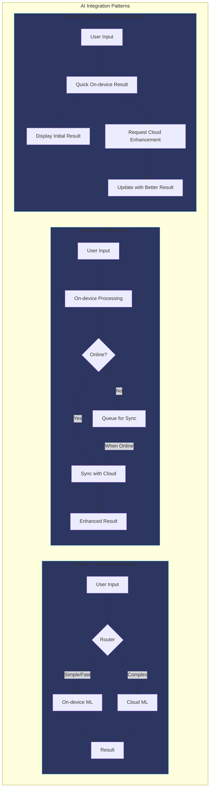

```mermaid
graph TB
    subgraph Patterns["AI Integration Patterns"]
        subgraph Pattern1["Pattern 1: Hybrid Processing"]
            P1_Input[User Input] --> P1_Router{Router}
            P1_Router -->|Simple/Fast| P1_OnDevice[On-device ML]
            P1_Router -->|Complex| P1_Cloud[Cloud ML]
            P1_OnDevice --> P1_Output[Result]
            P1_Cloud --> P1_Output
        end
        
        subgraph Pattern2["Pattern 2: Offline-First"]
            P2_Input[User Input] --> P2_OnDevice[On-device Processing]
            P2_OnDevice --> P2_Check{Online?}
            P2_Check -->|Yes| P2_Sync[Sync with Cloud]
            P2_Check -->|No| P2_Queue[Queue for Sync]
            P2_Sync --> P2_Output[Enhanced Result]
            P2_Queue -.->|When Online| P2_Sync
        end
        
        subgraph Pattern3["Pattern 3: Progressive Enhancement"]
            P3_Input[User Input] --> P3_Quick[Quick On-device Result]
            P3_Quick --> P3_Display[Display Initial Result]
            P3_Quick --> P3_Cloud[Request Cloud Enhancement]
            P3_Cloud --> P3_Update[Update with Better Result]
        end
    end
    
    style Pattern1 fill:#2d3561,stroke:#66d9ef
    style Pattern2 fill:#2d3561,stroke:#66d9ef
    style Pattern3 fill:#2d3561,stroke:#66d9ef
```