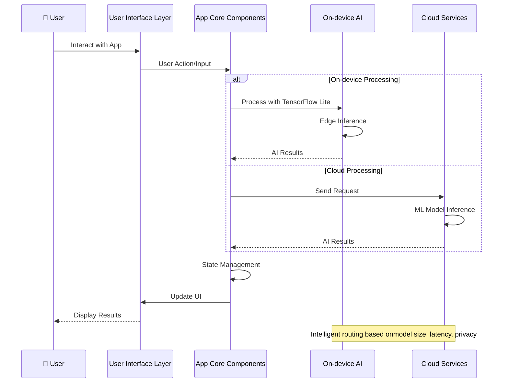

```mermaid
sequenceDiagram
    participant User as 👤 User
    participant UI as User Interface Layer
    participant Core as App Core Components
    participant OnDevice as On-device AI
    participant Cloud as Cloud Services
    
    User->>UI: Interact with App
    UI->>Core: User Action/Input
    
    alt On-device Processing
        Core->>OnDevice: Process with TensorFlow Lite
        OnDevice->>OnDevice: Edge Inference
        OnDevice-->>Core: AI Results
    else Cloud Processing
        Core->>Cloud: Send Request
        Cloud->>Cloud: ML Model Inference
        Cloud-->>Core: AI Results
    end
    
    Core->>Core: State Management
    Core->>UI: Update UI
    UI-->>User: Display Results
    
    Note over OnDevice,Cloud: Intelligent routing based onmodel size, latency, privacy
```