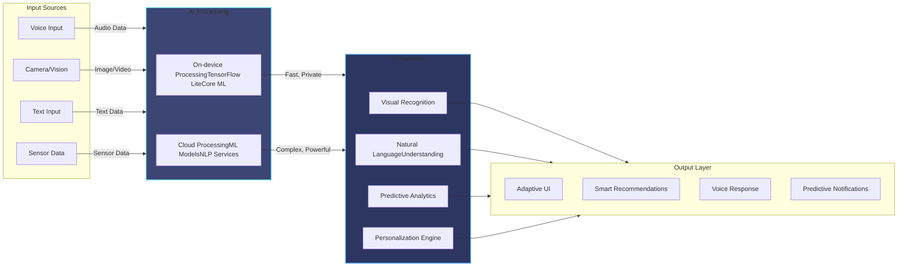

```mermaid
graph LR
    subgraph Input["Input Sources"]
        Voice[Voice Input]
        Camera[Camera/Vision]
        Text[Text Input]
        Sensors[Sensor Data]
    end
    
    subgraph Processing["AI Processing"]
        OnDeviceProc[On-device ProcessingTensorFlow LiteCore ML]
        CloudProc[Cloud ProcessingML ModelsNLP Services]
    end
    
    subgraph Intelligence["AI Features"]
        Recognition[Visual Recognition]
        NLU[Natural LanguageUnderstanding]
        Prediction[Predictive Analytics]
        Personalization[Personalization Engine]
    end
    
    subgraph Output["Output Layer"]
        AdaptiveUI[Adaptive UI]
        Recommendations[Smart Recommendations]
        VoiceResponse[Voice Response]
        Notifications[Predictive Notifications]
    end
    
    Voice -->|Audio Data| Processing
    Camera -->|Image/Video| Processing
    Text -->|Text Data| Processing
    Sensors -->|Sensor Data| Processing
    
    OnDeviceProc -->|Fast, Private| Intelligence
    CloudProc -->|Complex, Powerful| Intelligence
    
    Recognition --> Output
    NLU --> Output
    Prediction --> Output
    Personalization --> Output
    
    style Processing fill:#3d4574,stroke:#66d9ef,stroke-width:2px
    style Intelligence fill:#2d3561,stroke:#4dabf7,stroke-width:2px
```