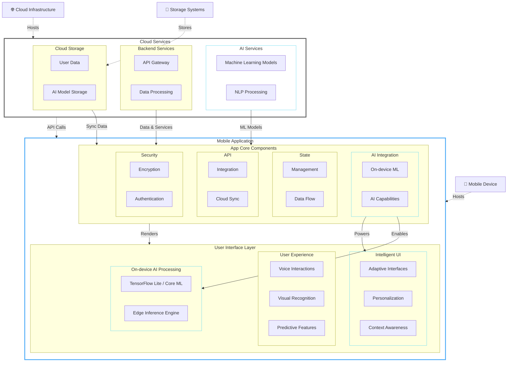

# AI-First Mobile App Architecture - Mermaid Diagrams

## Main Architecture Diagram

```mermaid
flowchart TB
 subgraph AIServices["AI Services"]
        MLModels["Machine Learning Models"]
        NLPProcessing["NLP Processing"]
  end
 subgraph BackendServices["Backend Services"]
        APIGateway["API Gateway"]
        DataProcessing["Data Processing"]
  end
 subgraph CloudStorage["Cloud Storage"]
        UserData["User Data"]
        AIModelStorage["AI Model Storage"]
  end
 subgraph CloudServices["Cloud Services"]
        AIServices
        BackendServices
        CloudStorage
  end
 subgraph AIIntegration["AI Integration"]
        OnDeviceML["On-device ML"]
        AICapabilities["AI Capabilities"]
  end
 subgraph State["State"]
        Management["Management"]
        DataFlow["Data Flow"]
  end
 subgraph API["API"]
        Integration["Integration"]
        CloudSync["Cloud Sync"]
  end
 subgraph Security["Security"]
        Encryption["Encryption"]
        Authentication["Authentication"]
  end
 subgraph AppCore["App Core Components"]
        AIIntegration
        State
        API
        Security
  end
 subgraph IntelligentUI["Intelligent UI"]
        AdaptiveInterfaces["Adaptive Interfaces"]
        Personalization["Personalization"]
        ContextAwareness["Context Awareness"]
  end
 subgraph UserExperience["User Experience"]
        VoiceInteractions["Voice Interactions"]
        VisualRecognition["Visual Recognition"]
        PredictiveFeatures["Predictive Features"]
  end
 subgraph OnDeviceAI["On-device AI Processing"]
        TensorFlowLite["TensorFlow Lite / Core ML"]
        EdgeInference["Edge Inference Engine"]
  end
 subgraph UserInterface["User Interface Layer"]
        IntelligentUI
        UserExperience
        OnDeviceAI
  end
 subgraph MobileApplication["Mobile Application"]
        AppCore
        UserInterface
  end
    CloudServices -. API Calls .-> MobileApplication
    AIServices -- ML Models --> AppCore
    BackendServices -- Data & Services --> AppCore
    CloudStorage -- Sync Data --> AppCore
    AppCore -- Renders --> UserInterface
    AIIntegration -- Powers --> IntelligentUI
    AIIntegration -- Enables --> OnDeviceAI
    MobileDevice["📱 Mobile Device"] -. Hosts .-> MobileApplication
    ServerIcon["🌐 Cloud Infrastructure"] -. Hosts .-> CloudServices
    DatabaseIcon["💾 Storage Systems"] -. Stores .-> CloudStorage

    style AIServices fill:transparent,stroke:#66d9ef
    style AIIntegration fill:transparent,stroke:#66d9ef
    style IntelligentUI fill:transparent,stroke:#66d9ef
    style OnDeviceAI fill:transparent,stroke:#66d9ef
    style CloudServices fill:transparent,stroke:#616161,stroke-width:3px
    style MobileApplication fill:transparent,stroke:#4dabf7,stroke-width:3px

```