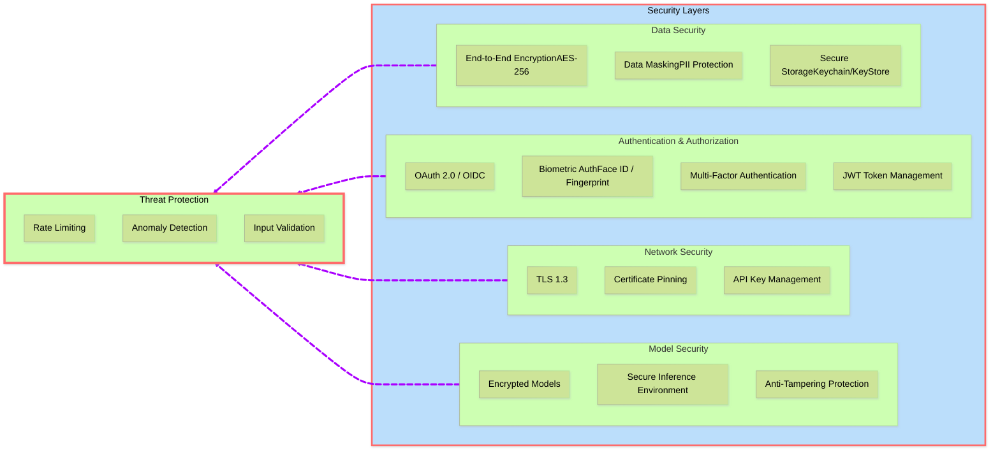

```mermaid
---
config:
  theme: forest
  look: neo
  layout: dagre
---
flowchart RL
 subgraph DataSecurity["Data Security"]
        Encryption["End-to-End EncryptionAES-256"]
        DataMasking["Data MaskingPII Protection"]
        SecureStorage["Secure StorageKeychain/KeyStore"]
  end
 subgraph AuthSecurity["Authentication & Authorization"]
        OAuth["OAuth 2.0 / OIDC"]
        Biometric["Biometric AuthFace ID / Fingerprint"]
        MFA["Multi-Factor Authentication"]
        JWT["JWT Token Management"]
  end
 subgraph NetworkSecurity["Network Security"]
        TLS["TLS 1.3"]
        CertPinning["Certificate Pinning"]
        APIKey["API Key Management"]
  end
 subgraph ModelSecurity["Model Security"]
        ModelEncryption["Encrypted Models"]
        SecureInference["Secure Inference Environment"]
        AntiTampering["Anti-Tampering Protection"]
  end
 subgraph SecurityLayers["Security Layers"]
        DataSecurity
        AuthSecurity
        NetworkSecurity
        ModelSecurity
  end
 subgraph ThreatProtection["Threat Protection"]
        RateLimiting["Rate Limiting"]
        AnomalyDetection["Anomaly Detection"]
        InputValidation["Input Validation"]
  end
    DataSecurity L_DataSecurity_ThreatProtection_0@==> ThreatProtection
    AuthSecurity L_AuthSecurity_ThreatProtection_0@==> ThreatProtection
    NetworkSecurity L_NetworkSecurity_ThreatProtection_0@==> ThreatProtection
    ModelSecurity L_ModelSecurity_ThreatProtection_0@==> ThreatProtection
    style Encryption color:#000000
    style ThreatProtection stroke:#ff6b6b,stroke-width:4px, text-color:#FF0000, color:#FF0000,color:#000000
    style SecurityLayers fill:#BBDEFB,stroke:#ff6b6b,stroke-width:3px,color:#000000
    linkStyle 0 stroke:#AA00FF,fill:none
    linkStyle 1 stroke:#AA00FF,fill:none
    linkStyle 2 stroke:#AA00FF,fill:none
    linkStyle 3 stroke:#AA00FF,fill:none
    L_DataSecurity_ThreatProtection_0@{ animation: fast } 
    L_AuthSecurity_ThreatProtection_0@{ animation: fast } 
    L_NetworkSecurity_ThreatProtection_0@{ animation: fast } 
    L_ModelSecurity_ThreatProtection_0@{ animation: fast }

```